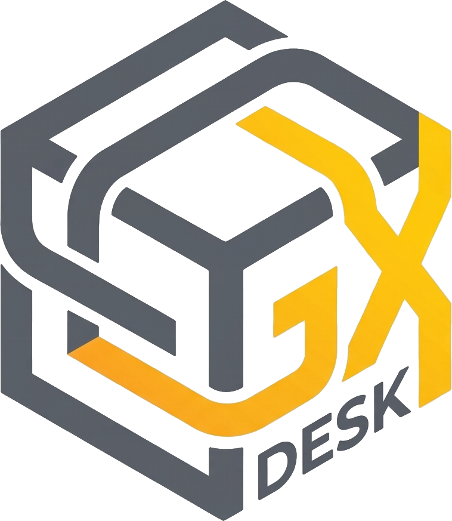
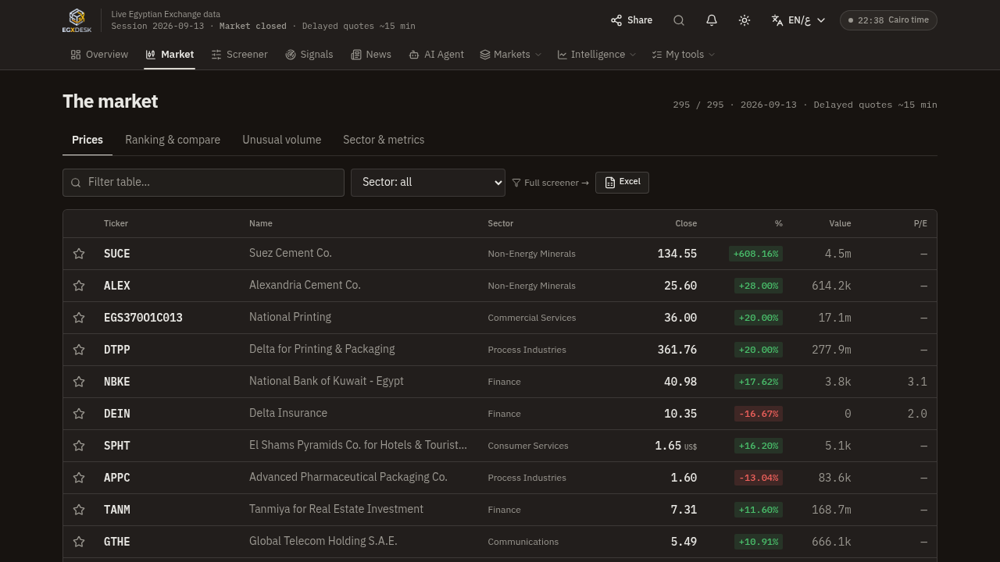

<div align="center">



# EGX Desk

**The free, Arabic-first, AI-native research desk for the Egyptian Exchange (EGX).**

Signals from **Technical + Fundamental + News analysis**, an **agentic AI assistant** with 1,000+ free cloud models,
investor flows, full financial statements, GCC markets, paper trading — **no login, no paywall, no ads.**

[](src/lib/version.ts)
[](#testing)
[](#testing)
[](LICENSE)
[](https://en.wikipedia.org/wiki/Egyptian_Exchange)



<sup>Live delayed data · Arabic-first with full English · installable as an app (PWA)</sup>

</div>

---

## Why this exists

Egypt's market is in a retail boom — **~123,000 new investors in H1-2026** and an EGX30 that rose ~40% in 2025 —
yet the serious tooling is either **global and paywalled** (TradingView, InvestingPro, Koyfin), **regional and paid**
(Mubasher Smart Signals), or a **brokerage app** that requires an account (Thndr). Nothing gives an Egyptian
retail investor a *free, Arabic-native desk* with transparent technical **and** fundamental analysis.

EGX Desk fills that seat. Every number is sourced and labeled, every method is inspectable, and the whole
thing runs without an account.

➡️ **Full competitive research & strategy: [`docs/COMPETITIVE-ANALYSIS.md`](docs/COMPETITIVE-ANALYSIS.md)**

---

## The Composite Signal Engine — Technical × Fundamental × News

The Signals tab ranks the **entire traded EGX universe** (and every company page carries the same three-pillar card) with a composite score built from three independent pillars:

| Pillar | What it measures | Weight |
|---|---|---|
| **Technical** | 13 indicators on 1-year daily candles — SMA 20/50/200, EMA 20/50/100, RSI-14, Stochastic %K/%D, MACD histogram, CCI-20, Momentum-10, Williams %R, BB Power (the same math as the in-app Technical Panel) | **45%** |
| **Fundamental** | 7 components in 3 pillars from reported financials — see below | **30%** |
| **News** | a transparent bilingual lexicon over the last **14 days** of the archived Egyptian business press (Alborsaanews + Amwal Alghad) — title double-weighted, recency-decayed (1.0 → 0.25), saturation-clamped so one headline never swings the pillar | **25%** |

### Fundamental pillars

| Pillar | Components (all real, reported fields) | Scoring |
|---|---|---|
| **Valuation** (.40) | P/E and P/B **vs sector medians** | log₂(median ÷ stock): half the median = +1, double = −1; loss-making TTM = −0.5 |
| **Quality** (.35) | ROE, net margin, debt/equity | ROE 25% = +1 / 8% = 0 · margin 25% = +1 / 10% = 0 · D/E 0.3 = +1 / 1.2 = 0 |
| **Income** (.25) | dividend yield, payout ratio | yield 10% = +1 / 0% = −0.4 · payout >100% = −0.8 (unsustainable) |

**Honesty rules baked in:** every component is null-safe (weights renormalize — a bank without P/B is never
punished, a stock with no press coverage in the window is neither punished nor rewarded); a stock with fewer than 2 fundamental components falls back to technical-only instead of a noisy
half-score; sector medians need ≥5 names or the market-wide median is used; every reason line quotes the real
numbers ("P/E 6.4 vs sector 7.6 · ROE 34.4%" / "2 press articles — 1 bullish, 0 bearish"). The news pillar is
re-blended at SERVE TIME (≤10-min press pass) so it never lags the hourly technical scan cache. The engine feeds the ranked table, the per-stock composite card, the CSV/XLSX exports, the
AI-signals evidence pack, and the agent's `technicals` tool — one math everywhere. See
[`src/lib/fundamentals.ts`](src/lib/fundamentals.ts) and [`src/lib/signals-scan.ts`](src/lib/signals-scan.ts).

A separate **AI Signals** mode runs a written, walk-forward-back-tested strategy charter through a GLM model
(shared compute — one call per cycle serves everyone) with ATR-based entry/stop/target levels.

---

## The AI Assistant — agentic, bilingual, free-cloud

A floating command center (⌘/Ctrl+K) inspired by modern AI-input UX — auto-growing composer, model chip,
streaming answers — that **executes**, not just chats. 20 bilingual tools: navigate any view or stock page,
live quotes, search, movers, technicals, news, GCC, watchlist add/remove, multi-condition alerts,
paper buy/sell/portfolio, language switching.

**Model switching across free online models (agent tab + assistant popup):**
- **GLM-4-Plus** via the app's own gateway — always on, no sign-in (agent-tab default)
- **3 KEYLESS cloud models — no sign-in, no key, no card, ever (LLM7.io)** — Codestral (fast, precise numbers), Mistral Nemo (fastest replies), MiniMax M2.7 (strong Arabic). Served server-side through the same SSE agent loop; work even where the Puter popup is blocked. The anonymous tier is one **globally shared** free daily pool — when strangers exhaust it, every keyless model **auto-falls back to GLM-4-Plus in <2s** with an honest streamed note + a permanent served-model chip on the answer (never a dead end)
- **Anti-fabrication gate (machine-verified answers)** — every agent final answer is cross-checked against the tool data it was built from before you see it: invented numbers (the classic small-model failure), leaked Chinese characters inside Arabic, and degenerate replies are caught, given ONE repair round, and — if a keyless model still fails — re-answered on the GLM-4-Plus backbone. Surviving outliers ship with an honest verification footnote; the app never silently trusts a model's memory
- **19 curated flagship families, free via the Puter cloud** — GPT-OSS 20B & 120B, GLM-5.3 / 5.3-Flash / 5.2, GPT-5.6 Luna, Claude Sonnet 5, Gemini 3.1 Pro, Grok 4.6, DeepSeek V4 Pro, Kimi K3, Qwen3-235B, Llama 4 Maverick & Scout, Mistral Large 3, MiniMax M2.5, Command A, Phi-4, Nemotron Super 49B (every id verified against the live catalog; the agent loop runs client-side, tools stay server-side)
- **1,008 real cloud models** in a searchable catalog, one free Puter sign-in away (no card, no API keys)
- An offline **Instant** regex router in the assistant popup
- **Never a stale app again:** a boot-time version guard compares the loaded shell against `/api/health` — if the browser (or an installed PWA) is running an older build, it unregisters the service worker, wipes the caches and self-heals with one reload

---

## The desk — 19 views

| | | |
|---|---|---|
| **Home** — market pulse, flows summary | **Market** — live table, 295 names | **Screener** — 40+ filters |
| **Signals** — composite TA+FA+News ranking + AI mode | **Heatmap & Sectors** | **Investors** — official retail/institutional/foreign flows + history |
| **Activity** — value/volume leaders | **Calendar** — earnings/dividends/events | **Funds** — money-market & ETF NAVs |
| **Compare** — side-by-side companies | **GCC** — Tadawul/DFM/ADX indices & movers | **News** — ~9,900-item bilingual archive |
| **Agent** — streaming AI analyst (16 tools) | **Strategy Lab** — back-test chartered rules | **Reports** — hourly AI desk reports |
| **Watchlist** · **Paper Trading** — EGP 100k simulator with commissions, P&L, trade log | **Tools** — dividend/FX calculators | |

Company pages add: 21 chart indicators (tunable), drawing tools (trendlines, levels), full financial
statements (income / balance / cash-flow, 5FY + quarterly), dividends, insiders, valuation, disclosures log,
and the signals-lite engine (streaks, unusual volume, 52-week position).

## Data sources — verified & labeled

| Data | Source | Notes |
|---|---|---|
| Quotes & TTM fundamentals | TradingView scanner | delayed ~15 min |
| Daily candles & indices | Yahoo Finance | 209 EGX tickers; 86 history-less names get verified milestone-fallback charts |
| Financial statements | stockanalysis.com | ~52 large/mid caps, EGP mn as filed |
| Investor flows | Sigma Capital (republishes the official EGX table) | arithmetic self-validated on every parse |
| News | two Egyptian publishers' public archives | bilingual, 9.9k items |
| GCC | TradingView + Yahoo | TASI/MT30/DFMGI/ADI |

Every panel states its source and delay. When free data is impossible (real-time quotes, the official
disclosure archive), the UI says so instead of faking it.

## Tech stack

Next.js 16 (App Router) · React 19 · TypeScript · Tailwind CSS + shadcn/ui · Prisma + SQLite ·
z-ai-web-dev-sdk (GLM) · Puter.js (free cloud models) · PWA service worker (offline shell, install,
web push) · Recharts + custom canvas charting · 841-key Arabic/English i18n with RTL-correct layouts.

## Performance — fast first load (v2.24)

The desk opens fast on any connection, by construction:

- **Per-view code splitting** — all 22 views are lazy chunks; the first page load ships the shell + the
  active view only (recharts, the markdown renderer and framer-motion used to ship with every load).
- **Idle prefetch** — after first paint the remaining view chunks warm one-per-idle-slot (data-saver
  users exempt), so navigation stays instant without paying the cost up front.
- **Lazy AI assistant** — the 875-line agentic panel (+ animation + markdown stack) mounts on first
  Ctrl+K / orb click instead of every page load.
- **Asset diet** — header logo PNGs re-encoded from 1.5MB each to ~5KB (4× retina), PWA icons
  optimized, AI-answer serif fonts (Lora/Amiri) no longer preloaded (~900KB off the critical path).
- **Lighter service worker** — screenshots dropped from the install precache; versioned logo URLs
  retire old caches on activate.

## Quick start

```bash
git clone https://github.com/mahmoudmohamedxx1-hue/egxdesk.git
cd egxdesk
bun install                    # or npm install
echo 'DATABASE_URL="file:./db/custom.db"' > .env
bunx prisma db push            # create the SQLite schema
bun run dev                    # http://localhost:3000
```

Production:

```bash
bun run build && bun run start
```

Optional `.env`: `DATABASE_URL` (SQLite path) and VAPID keys for web-push notifications — everything
else works with zero configuration and zero API keys.

## Testing

14 end-to-end/API suites cover the whole surface — run against a live dev server:

```bash
bun scripts/e2e/api-test.js          # 100 checks — every route, NaN/consistency guards
bun scripts/e2e/t21-features-test.ts # 62 checks — exports, alerts, signals, GCC, paper
bun scripts/e2e/t22-reports-test.ts  # 67 checks — hourly reports & agent answers
bun scripts/e2e/t20-ai-signals-test.ts
bun scripts/e2e/t16-endpoints-test.js # 17 chat/endpoint checks
bun scripts/e2e/new-endpoints-test.js # 36 checks — newest routes
bun scripts/t31-test-fundamentals.ts  # 29 unit checks — composite engine math
bun scripts/t32-test-news.ts            # 27 unit checks — the news pillar
bun scripts/t35-test-models.ts           # 30 unit checks — model registry + version guard
bun scripts/t37-test-failover.ts         # 10 live checks — LLM7→GLM auto-failover (quota-exhaustion path)
bun scripts/t37-test-risk-levels.ts      # 18 unit checks — price-adaptive ATR levels (penny-stock R:R integrity)
bun scripts/t38-test-audit-fixes.ts       # 64 unit checks — anti-fabrication gate, ticker aliases, Arabic search, UI regressions
bunx tsc --noEmit && bunx eslint src/
```

## Project structure

```
src/
  app/            # 28 API routes + the single-page App Shell entry
  components/
    market/       # app shell, chart workstation (21 indicators), AI assistant, panels
    views/        # the 19 desk views
  lib/            # 43 engine modules: market, history, indicators, fundamentals,
                  # signals-scan, ai-signals, strategy, paper, alerts, flows, i18n…
  data/           # backtest results backing the AI-signal charter
scripts/
  e2e/            # the 12 test suites
  research/       # source-verification logs + competitive research
docs/             # COMPETITIVE-ANALYSIS.md — deep research & roadmap
```

## Where we stand

**We lead** (see the [full analysis](docs/COMPETITIVE-ANALYSIS.md)): the only free whole-market TA+FA
composite for EGX · the only agentic AI desk that executes actions · investor flows nobody else shows free ·
zero-login everything · Arabic-native + English · PWA install · honesty labeling.

**We're behind**: real-time quotes (~15-min delay), fair-value modeling depth, community features,
app-store presence, and brand reach. The roadmap (3 waves) attacks these in order:
① public signal track-record + per-ticker SEO pages + portfolio CSV import + Play Store TWA →
② transparent fair-value layer + Telegram/WhatsApp alerts + Arabic AI morning brief →
③ real-time feed partnership + community notes + public API.

## Disclaimer

Market data is delayed and provided for research/education. Nothing here is investment advice.
Signals are statistical descriptions of price action and reported financials — inspect the formula,
do your own work, manage your risk.

## License

[MIT](LICENSE) — use it, learn from it, build on it.
